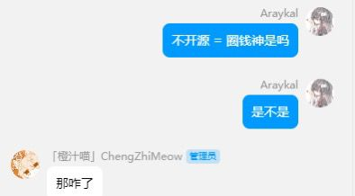
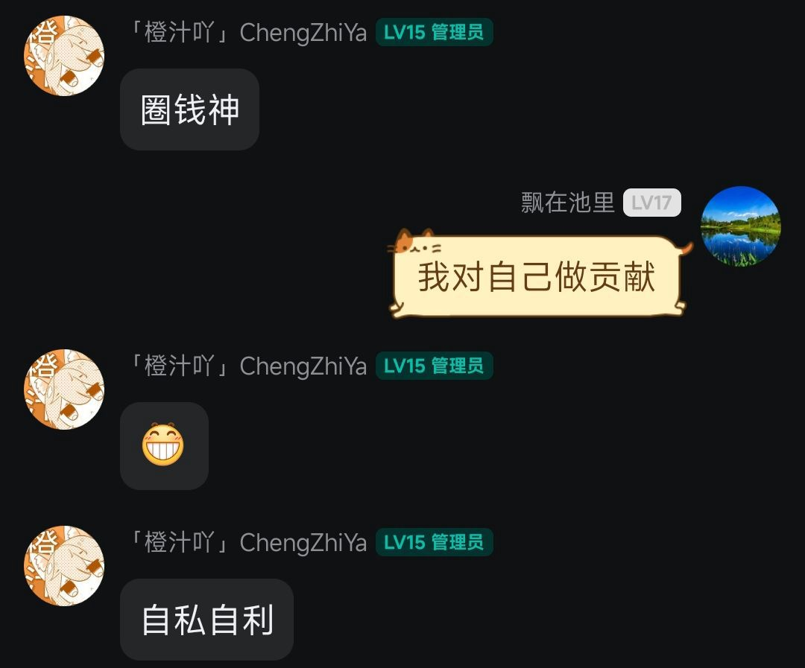
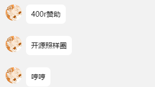

   

# MHDF-Tools

_✨一款轻量化便携性的Bukkit基础插件✨_

_✨轻量 便携 快捷 即装即用 可无前置运行✨_

<i>喜欢何祖濠小朋友的开源工具么？</i>

  
  

    何祖濠特征：

<ul style="list-style-type: none; padding: 0;">
    <li style="font-size:16px; color:#555;">白眼狼</li>
    <li style="font-size:16px; color:#555;">背刺神</li>
    <li style="font-size:16px; color:#555;">喜欢背后议论</li>
    <li style="font-size:16px; color:#555;">天才神童</li>
    <li style="font-size:16px; color:#555;">跨性别者</li>
    <li style="font-size:16px; color:#555;">22条染色体</li>
</ul>

    
橙汁这人有多乐子呢,据神秘人反馈，神秘修复代码，刚发给他就会拿来开源,也是无敌了

    
很喜欢橙汁的一句话: 

    

由于此人太过于脑残,故对他进行打击。

    
写此言论，并不是针对开源开发者，本言论仅针对何祖濠一人

    
闭源 != 圈钱

    
白眼狼可耻

珍惜你的代码，珍惜你的服务器。

    
    
    
    
    

## 前置插件 (可选)

- [CraftEngine](https://github.com/Xiao-MoMi/craft-engine)
- [PlaceholderAPI](https://www.spigotmc.org/resources/placeholderapi.6245)
- [MythicMobs](https://mythiccraft.io/index.php?resources/mythicmobs.1)
- [Vault](https://www.spigotmc.org/resources/vault.34315)

    

## 贡献者

## 特别感谢

- [LuckPerms](https://github.com/LuckPerms/LuckPerms) 依赖下载与加载部分代码参考
- [TridentDupe](https://github.com/Killetx/TridentDupe) 三叉戟复制漏洞思路参考

## 精神支柱

- [Xiao-MoMi](https://github.com/Xiao-MoMi)

## Star

